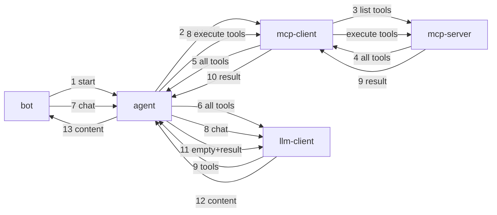

Test
```
cls;npx tsc;node dist/agent/agent.test.js
cls;npx tsc;node dist/llm/llm-client.test.js
cls;npx tsc;node dist/llm/openai-client.test.js
cls;npx tsc;node dist/mcp/mcp-client.test.js
cls;npx tsc;node dist/bot-query.test.js
cls;npx tsc;node dist/bot-query.stream.test.js
cls;npx tsc;node dist/bot-conversation.test.js
cls;npx tsc;node dist/bot-conversation.stream.test.js
cls;npx tsc;node dist/bot-chat.test.js
cls;npx tsc;node dist/bot-chat.stream.test.js
cls;npx tsc;node dist/bot-server.test.js
```

            (for debug purpose) => llmClient.invokeInvoke => chat/completions
bot.invokeQuery => agent.invoke => llmClient.invokeStream => chat/completions stream
bot.streamQuery => agent.stream => llmClient.streamStream => chat/completions stream


---

# 🧠 TT AI Agent

A **headless AI agent framework** built for LLM applications. Features include:

* ✅ Configurable OpenAI-compatible API providers (e.g., [OpenRouter](https://openrouter.ai))
* ✅ Pluggable model support (ChatGPT, DeepSeek, etc.)
* ✅ MCP (Model Context Protocol) server integration for custom tools (e.g., fetch weather, call CLI tools)

---

## 🏗️ Architecture

> Architecture documentation coming soon.


Agent (context) 
  - create mcp clients
  - create openai client

---

## 🚀 Getting Started

### 📦 Install

```bash
npm install tt-ai-agent
```

### 🛠️ Usage

#### 👉 Ask a Single Question

```ts
import Bot from 'tt-ai-agent/bot';

const bot = new Bot();
const answer = await bot.ask('What is the capital of France?');
console.log(answer);
```

#### 💬 Start an Interactive Chat

```ts
import Bot from 'tt-ai-agent/bot';

const bot = new Bot();
await bot.chat();
```

---

### ⚙️ Example: `ttconfig.json`

Customize your agent with API provider info, model selection, and MCP integration:

```json
{
  "apiProvider": {
    "apiKey": "sk-this-will-be-replaced-by-env",
    "apiBaseURL": "https://openrouter.ai/api/v1"
  },
  "model": "deepseek/deepseek-chat-v3-0324:free",
  "mcpServers": {
    "slack-mcp": {
      "disabled": false,
      "command": "node",
      "args": [
        "C:/Workspace/ai/slack-mcp-server/build/index.js"
      ]
    }
  }
}
```
### FAQ

Certainly! Here's the translated version of the error message and full explanation:

---

### ❗ Error

```
[ERRR] Error invoking agent: Error: 429 Rate limit exceeded: free-models-per-day. Add 10 credits to unlock 1000 free model requests per day
```

### 💡 Cause:

You're using the **OpenRouter** API and calling a **free model** (like `deepseek`). These free models have a **daily request limit**.

HTTP status code `429` means **Too Many Requests** — you've exceeded your daily quota.

---

## ✅ How to Fix

### 1. **Sign up / log in to OpenRouter**

Go to [https://openrouter.ai/](https://openrouter.ai/) and log in with your account.

---

### 2. **Add \$10 in credits**

Once you add at least \$10 in credits, you unlock **1000 free requests per day** for free-tier models.

* Supports credit cards, crypto, etc.
* Your funds won’t be consumed unless you exceed free quotas — the credit just unlocks the daily limits.

---

### 3. **(Alternative) Use a different model**

You could switch to another model with fewer restrictions, but free models usually have similar limitations or may be less reliable.

---

### 4. **Monitor your usage**

You can check your usage and quota at the OpenRouter dashboard:
[https://openrouter.ai/dashboard](https://openrouter.ai/dashboard)

---

## 🔐 Best Practice: Use Environment Variables for API Keys

Use a `.env` file to store your API key securely:

```
OPENROUTER_API_KEY=your-openrouter-key
```

Then load it in your code:

```ts
import 'dotenv/config';

const apiKey = process.env.OPENROUTER_API_KEY;
```

---

If you’ve already added credits but still get the error, double-check:

* That you're using the correct API key (from a funded account)
* Your headers are correctly passing the key
* Your daily usage hasn't actually exceeded the 1000 requests

If you'd like me to help review your request code or configuration, feel free to share it!


---

## 🧪 For Developers

### 🧰 Project Setup

```bash
npm init -y
```

#### Install Runtime Dependencies

```bash
npm install dotenv openai chalk @modelcontextprotocol/sdk
```

#### Install Development Dependencies

```bash
npm install --save-dev typescript  @types/node 

npm install --save-dev jest ts-jest @types/jest
```

### ⚙️ TypeScript Config

```bash
npx tsc --init
```

Update `tsconfig.json`:

```json
{
  "compilerOptions": {
    "target": "ES2020",
    "module": "NodeNext",
    "moduleResolution": "NodeNext",
    "declaration": true,
    "outDir": "dist",
    "rootDir": "src"
  },
  "include": ["src"]
}
```

### 🛠 Build the Project

```bash
npx tsc
```

### ▶️ Run the Project

```bash
node dist/index.js
```
---

### 🚀 Unit Tests

```bash
npx jest
```

```json
  "scripts": {
    "test": "jest"
  },
```
then 
```bash
npm test
```
---

### 🚀 Create a CLI Tool

In `package.json`:

```json
{
  "bin": {
    "my-openai-agent": "dist/cli.js"
  },
  "exports": {
    ".": "./dist/main.js",
    "./McpClient": "./dist/McpClient.js"
  },
  "files": ["dist"]
}
```

In `cli.ts`, add the shebang line:

```ts
#!/usr/bin/env node
```

Then:

```bash
npx tsc
npm pack
```

---

### 📦 Publish to npm (optional)

```bash
npm login
npm publish --access=public
```

---

## 🔧 Tech Stack

* 🟦 Node.js
* 🟨 TypeScript
* ☁️ OpenAI & compatible APIs
* 🔌 MCP SDK

---